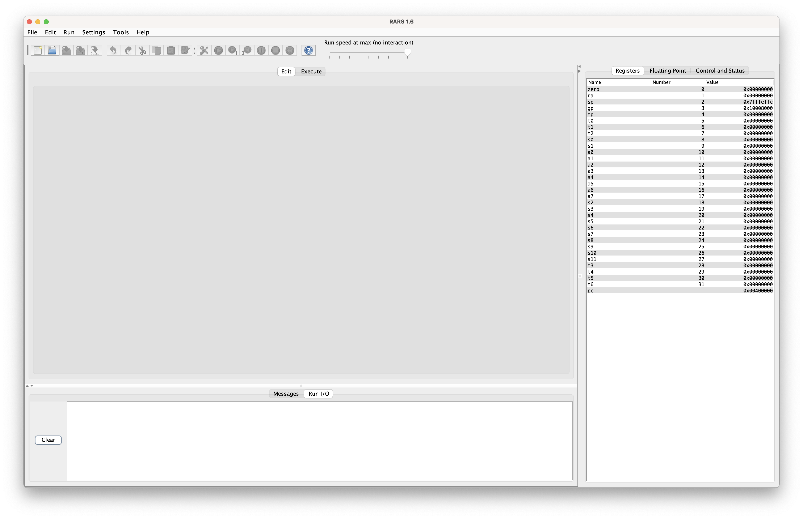
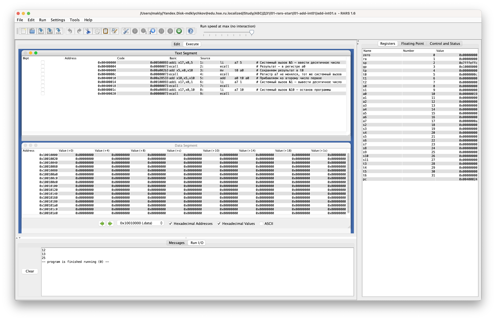
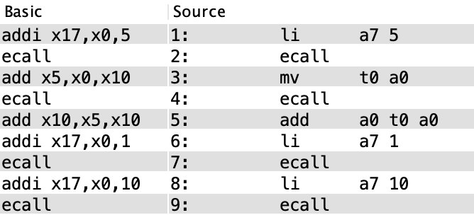
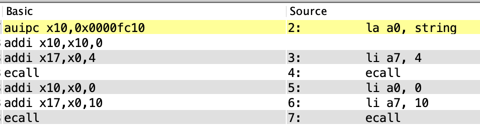
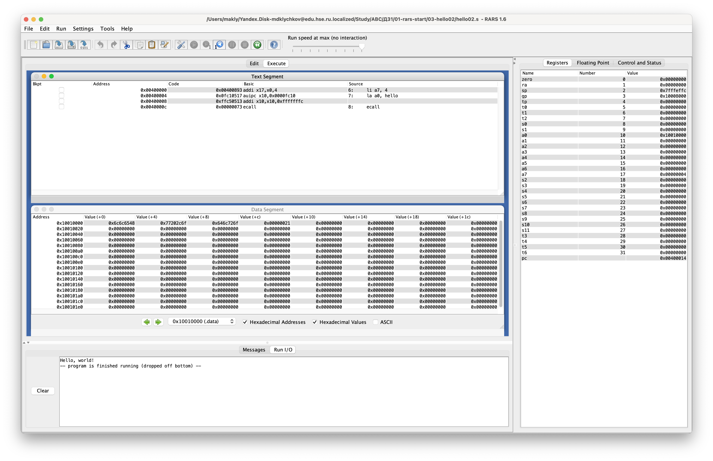
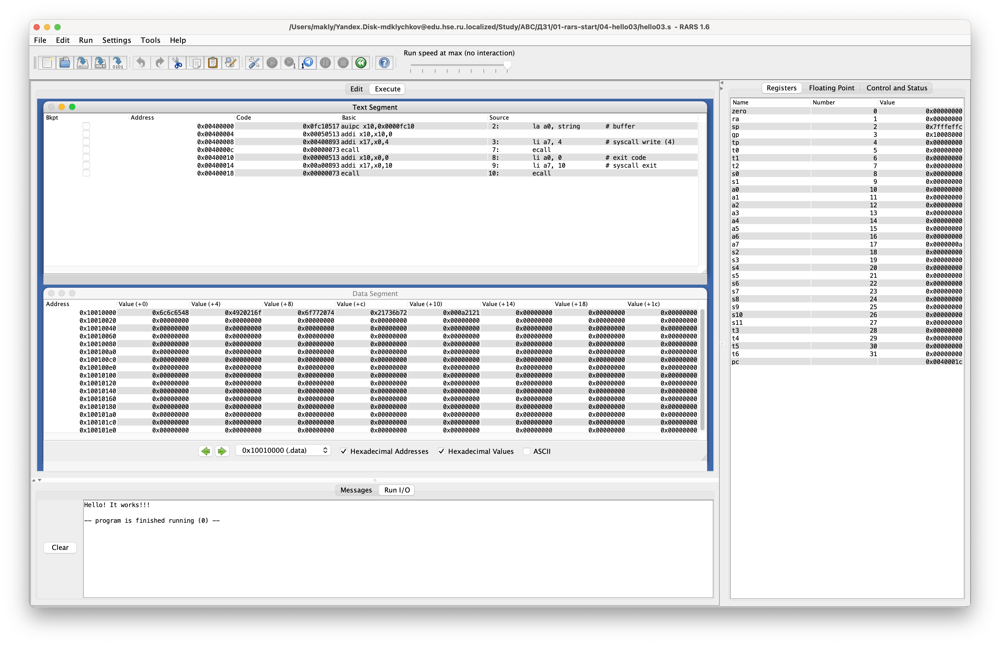
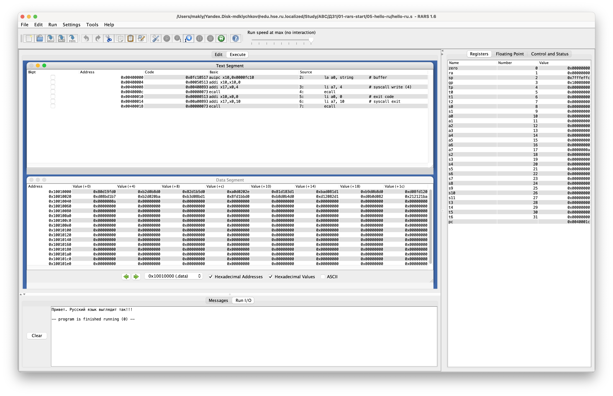
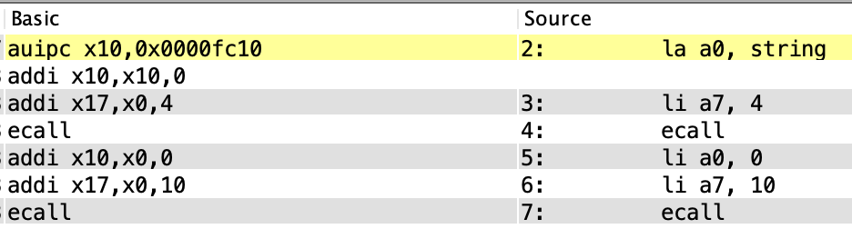
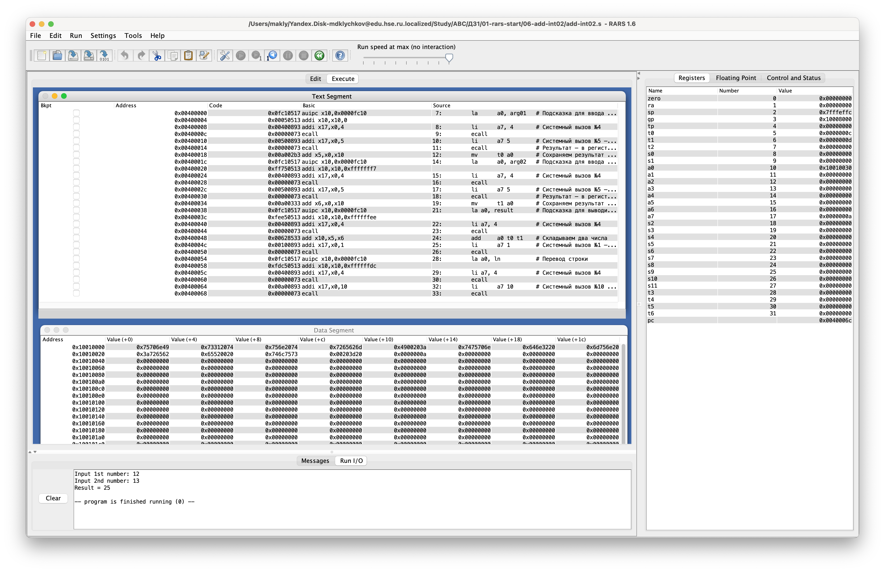
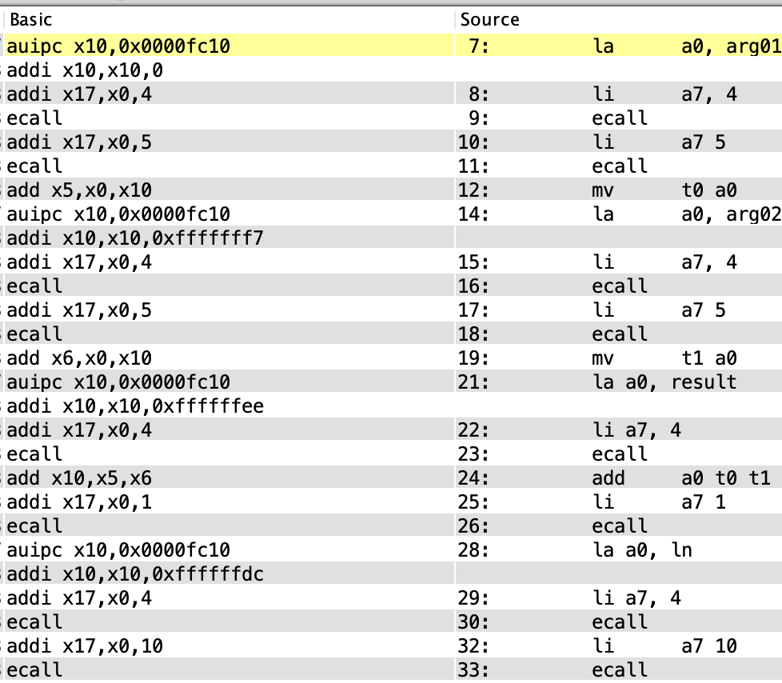

# Отчет по ДЗ #1

- [Отчет по ДЗ #1](#отчет-по-дз-1)
  - [Установка эмулятора](#установка-эмулятора)
  - [Запуск программ из LMS с пояснениями](#запуск-программ-из-lms-с-пояснениями)
    - [01-add-int01](#01-add-int01)
    - [02-hello01](#02-hello01)
    - [03-hello02](#03-hello02)
    - [04-hello03](#04-hello03)
    - [05-hello-ru](#05-hello-ru)
    - [06-add-int02](#06-add-int02)
  - [Системные вызовы](#системные-вызовы)
    - [Что это и как их обнаружить в приведенных программах](#что-это-и-как-их-обнаружить-в-приведенных-программах)
    - [Таблица](#таблица)
  - [Дополнительное задание: видео](#дополнительное-задание-видео)

## Установка эмулятора

Установка эмулятора прошла успешно, без казусов 👍

## Запуск программ из LMS с пояснениями

### 01-add-int01

На примере этой программы построим таблицу, где для каждой команды укажем, является ли она псевдокомандой.

Чтобы вынести решение о каждой инструкции, посмотрим следующий кусочек таблицы из скриншота выше.

Например, команда "положить число в регистр" "развернется" в команду "сложить I-число с регистром zero (нестираемым нулём) и положить результат в регистр".

|     | Команда | Является ли псевдокомандой |
| --- | ------: | :------------------------: |
| 1   |    `li` |             ✅              |
| 2   | `ecall` |             ❌              |
| 3   |    `mv` |             ✅              |
| 4   | `ecall` |             ❌              |
| 5   |   `add` |             ❌              |
| 6   |    `li` |             ✅              |
| 7   | `ecall` |             ❌              |
| 8   |    `li` |             ✅              |
| 9   | `ecall` |             ❌              |

### 02-hello01

Для этой программы опишем типы форматов команд (рассмотрим как "настоящие" команды, так и команды, в которые "превращаются" псевдокоманды):

| Команда | Тип                                             |
| ------: | :---------------------------------------------- |
| `auipc` | U ("непосредственное значение-регистр")         |
| ` addi` | I ("непосредственное значение-регистр-регистр") |
| `ecall` | I ("непосредственное значение-регистр-регистр") |

### 03-hello02

### 04-hello03

### 05-hello-ru

На примере этой программы вновь проанализируем команды, чтобы узнать являются ли они псевдокомандами.

|     | Команда | Является ли псевдокомандой |
| --- | ------: | :------------------------: |
| 2   |    `la` |             ✅              |
| 3   |    `li` |             ✅              |
| 4   | `ecall` |             ❌              |
| 5   |    `li` |             ✅              |
| 6   |    `li` |             ✅              |
| 7   | `ecall` |             ❌              |

### 06-add-int02

Для этой программы опишем типы форматов команд (рассмотрим как "настоящие" команды, так и команды, в которые "превращаются" псевдокоманды):

| Команда | Тип                                             |
| ------: | :---------------------------------------------- |
| `auipc` | U ("непосредственное значение-регистр")         |
| ` addi` | I ("непосредственное значение-регистр-регистр") |
| `ecall` | I ("непосредственное значение-регистр-регистр") |
|   `add` | R ("типа «регистр-регистр-регистр")             |

## Системные вызовы

### Что это и как их обнаружить в приведенных программах

Согласно Википедии:
> In computing, a **system call** (commonly abbreviated to **syscall**) is the programmatic way in which a computer program requests a service from the operating system on which it is executed.

Чтобы произвести системный вызов необходимо загрузить номер вызова в регистр `a7`. Для построения таблицы с системными вызовами приведенных программ воспользуемся внутренней документацией **RARS** и соответственно номерами команд.

### Таблица

Приведенная таблица содержит все системные вызовы из программ в папке семинара.

| Name        | Number | Description                                    | Inputs                         | Outputs      |
| ----------- | ------ | ---------------------------------------------- | ------------------------------ | ------------ |
| PrintInt    | 1      | Prints an integer                              | a0 = integer to print          | N/A          |
| PrintString | 4      | Prints a null-terminated string to the console | a0 = the address of the string | N/A          |
| ReadInt     | 5      | Reads an int from input console                | N/A                            | a0 = the int |
| Exit        | 10     | Exits the program with code 0                  | N/A                            | N/A          |

## [Дополнительное задание: видео](Дополнительно.mp4)