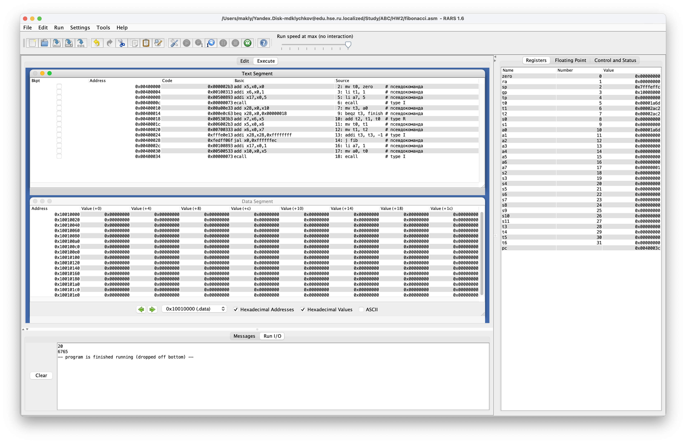
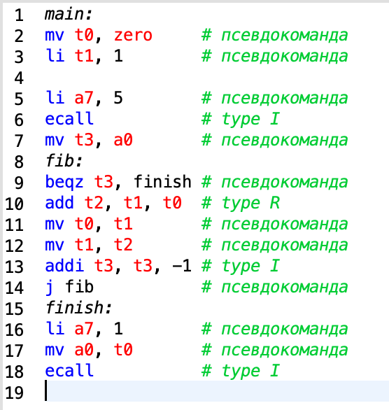
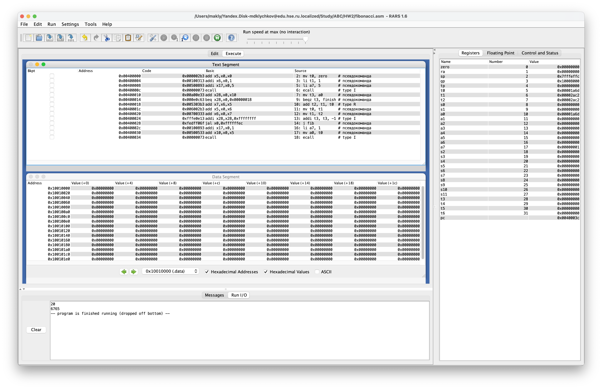
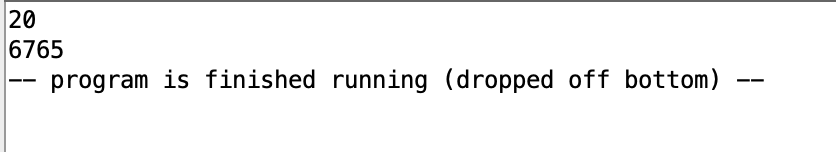
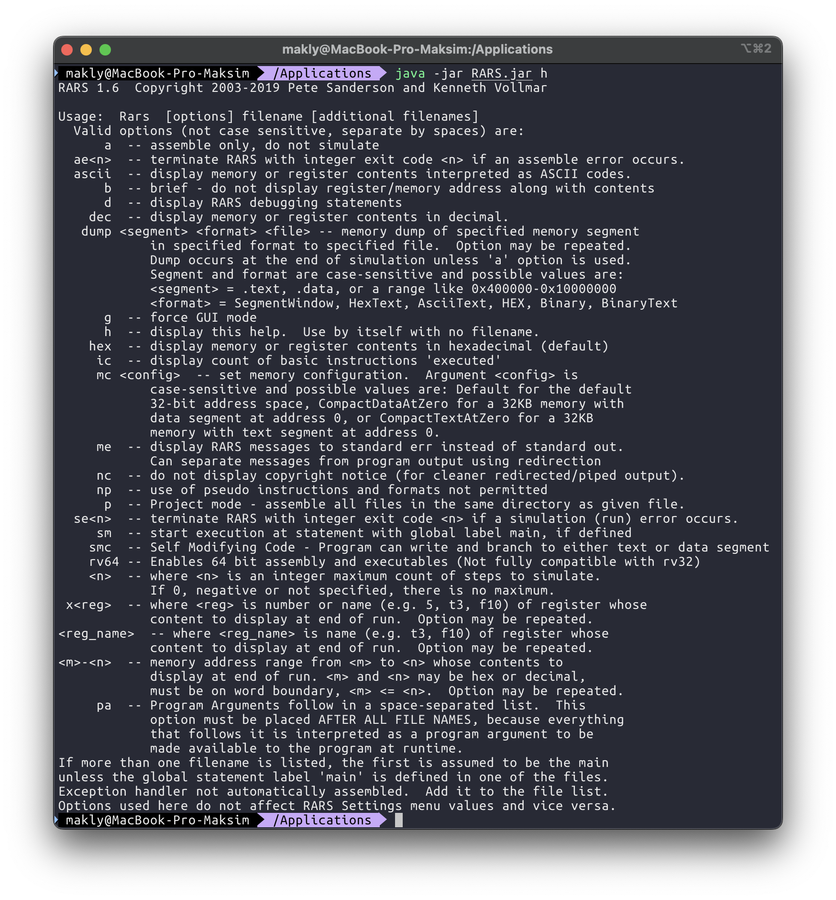
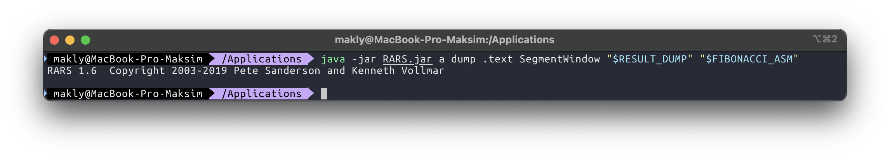
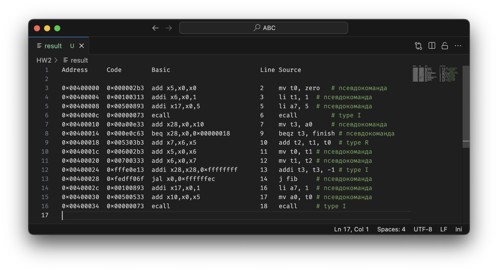
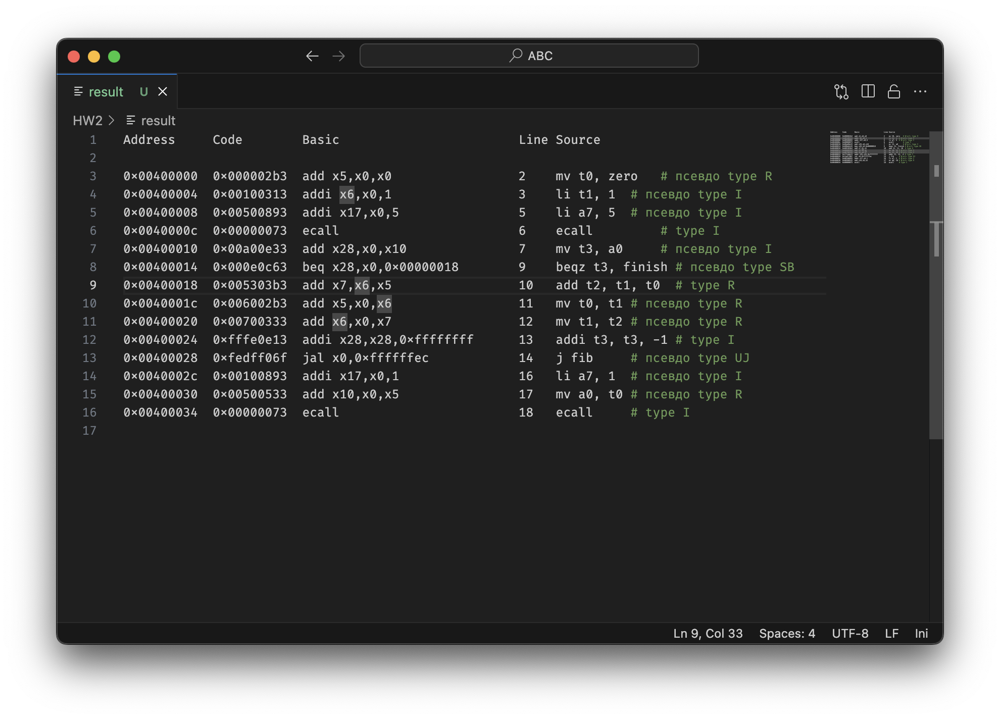

# Отчет по ДЗ #2

## Программа для вычисления чисел Фибоначчи

Вручную была переписана программа со слайда 👍



Вот так выглядит сама программа с написанными комментариями:



Программа была запущена для $n = 20$:



Получен результат:



## Дополнительное задание: Дамп

Чтобы понимать, как пользоваться **RARS** в консольном режиме использовалась команда `h` – *"help"*:



Тут находим информацию о команде `dump`:

```console
dump <segment> <format> <file> -- memory dump of specified memory segment
            in specified format to specified file.  Option may be repeated.
            Dump occurs at the end of simulation unless 'a' option is used.
            Segment and format are case-sensitive and possible values are:
            <segment> = .text, .data, or a range like 0x400000-0x10000000
            <format> = SegmentWindow, HexText, AsciiText, HEX, Binary, BinaryText
```


Выполняем команду:



В переменных `RESULT_DUMP` и `FIBONACCI_ASM` хранятся пути для файла результата и файла с программой. Запущенная в консоли программа ассемблирует переданный файл, а затем делает `dump` текста программы в виде `SegmentWindow` (удобночитаемым для человека).

Вот так выглядит только что полученный файл с результатом:



Теперь в комментариях в конце каждой строки допишем формат команды (если это псевдокоманда, то пишем формат у "базовой" команды), получим:



[Ссылка на сам файл с результатом](result)