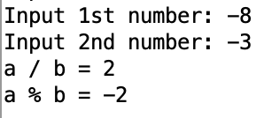

# Отчет по ДЗ #2

## Программа вычисления частного и остатка от деления

Было принято решение для каждой комбинации знаков числителя и знаменателя сделать отдельный случай (`label`) и отдельный цикл. Отдельно написаны подпрограммы вывода ошибки, результата и завершения работы программы.

main и вывод ошибки:


Обработка положительного числителя:


Обработка отрицательного числителя:


Вывод результата и останов:


[Здесь расположен полный код программы](div.asm)

## Тестирование программы вручную


| b\a | 8                          | -8                          |
| --- | -------------------------- | --------------------------- |
| 3   |   |   |
| -3  |  |  |


| b\a | 3                          | -3                           |
| --- | -------------------------- | ---------------------------- |
| 8   |   |   |
| -8  |  |  |

## Программа для автоматического тестирования

Подпрограмма выводящая исходные данные:


Подпрограмма, запускающая тест:


Сами тесты в main:


[Здесь расположен полный код тестирующей программы](div_test.asm)

Также прикладываю вывод тестирующей программы:

```console
Input 1st number: 12
Input 2nd number: 0
Error: Division by zero

Input 1st number: 0
Input 2nd number: 12
a / b = 0 excpected 0
a % b = 0 excpected 0

Input 1st number: 8
Input 2nd number: 3
a / b = 2 excpected 2
a % b = 2 excpected 2

Input 1st number: 8
Input 2nd number: -3
a / b = -2 excpected -2
a % b = 2 excpected 2

Input 1st number: -8
Input 2nd number: 3
a / b = -2 excpected -2
a % b = -2 excpected -2

Input 1st number: -8
Input 2nd number: -3
a / b = 2 excpected 2
a % b = -2 excpected -2

Input 1st number: 3
Input 2nd number: 8
a / b = 0 excpected 0
a % b = 3 excpected 3

Input 1st number: 3
Input 2nd number: -8
a / b = 0 excpected 0
a % b = 3 excpected 3

Input 1st number: -3
Input 2nd number: 8
a / b = 0 excpected 0
a % b = -3 excpected -3

Input 1st number: -3
Input 2nd number: -8
a / b = 0 excpected 0
a % b = -3 excpected -3
```
