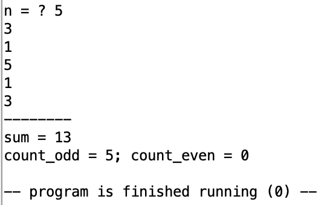
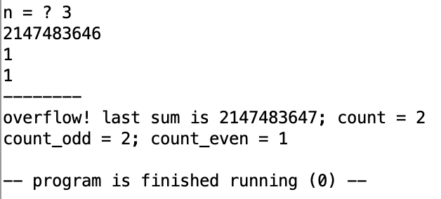
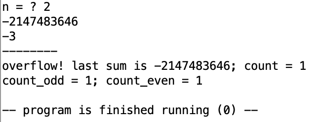
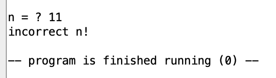

# Отчет по ДЗ #4

Так как в задании вообще не сказано про отчет, просто приложу сюда скриншоты работы.

## Программа вычисления суммы элементов массива с проверкой переполнения

Полный код программы расположен 🤜[тут](array.asm)🤛

Нормальная работа программы:

Ошибка переполнения:

Ввод неправильного $n$:

