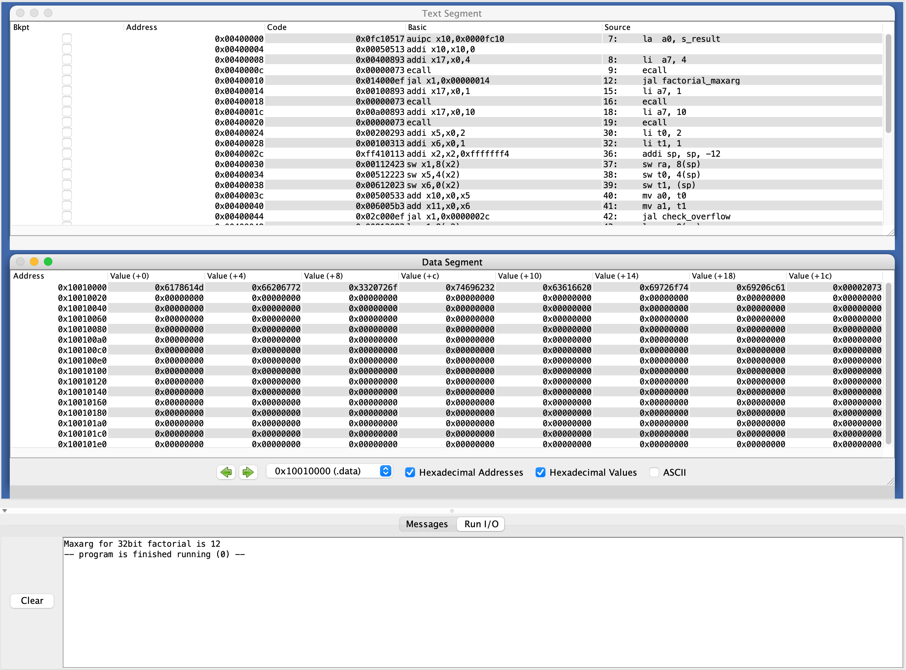

# Отчет по ДЗ #5

## Программа вычисления максимального аргумента факториала через цикл

Полный код программы расположен 🤜[тут](factorial_loop.asm)🤛

Скриншот работы программы:



Для проверки переполнения я использовал отдельную функцию

```
check_overflow:
	# check overflow for a0 * a1; if (overflow) return 0;
	mul t0, a0, a1
	div t1, t0, a0
	
	bne t1 a1 check_overflow_true
	li a0 0
	ret
check_overflow_true:
	li a0 1
	ret
```

В зависимости от возвращенного результата, прерывал цикл или считал факториал для следующего $n$.

Так выглядит `main` программы, вызывающий лишь функцию вычисления максимального аргумента:

```
main:
	# Print text
	la 	a0, s_result
	li 	a7, 4
	ecall
	
	# func call
	jal factorial_maxarg
	
	# Print result
    li a7, 1
    ecall
    # Exit
    li a7, 10
    ecall
```

## Дополнительное задание: Программа вычисления максимального аргумента факториала через рекурсию

Полный код программы расположен 🤜[тут](factorial_rec.asm)🤛

Из прошлой задачи возьмем функцию проверки на переполнение.

Сама рекурсивная функция `factorial_maxarg` работает согласно этому псевдокоду:

```c
int factorial_maxarg(cur, res):
	inc_cur = cur + 1;
	if (check_overflow(inc_cur, res)) return cur;
	res *= inc_cur;
	return factorial_maxarg(inc_cur, res);
```

Тут `cur` и `res` такие, что `cur! = res`.

Так выглядит `main`:

```
main:
	# Print text
	la 	a0, s_result
	li 	a7, 4
	ecall
	
	# func call
	li a0, 1
	li a1, 1
	jal factorial_maxarg
	
	# Print result
    li a7, 1
    ecall
    # Exit
    li a7, 10
    ecall
```