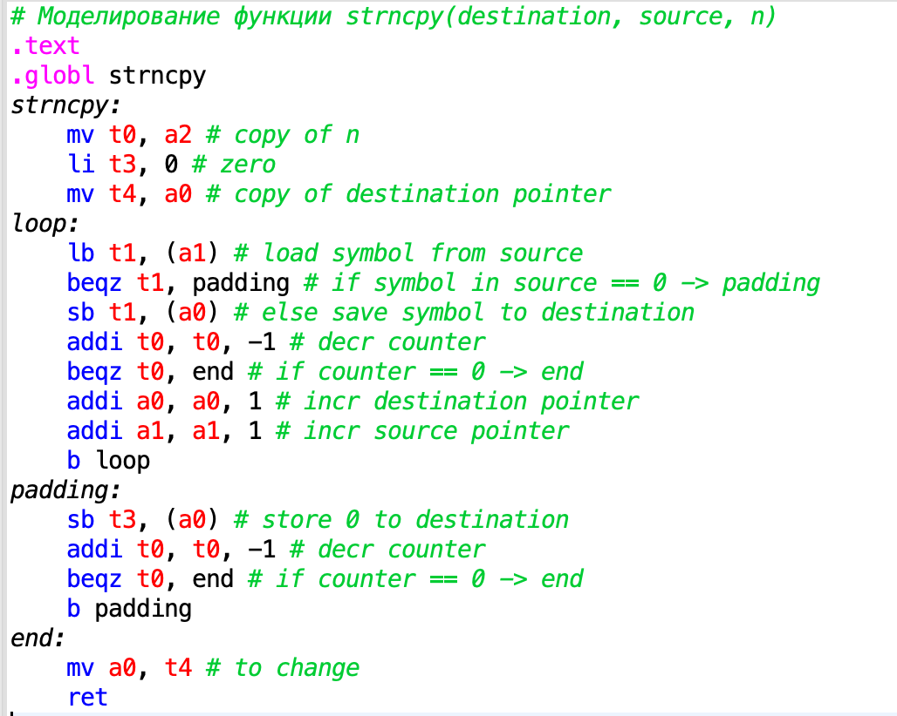
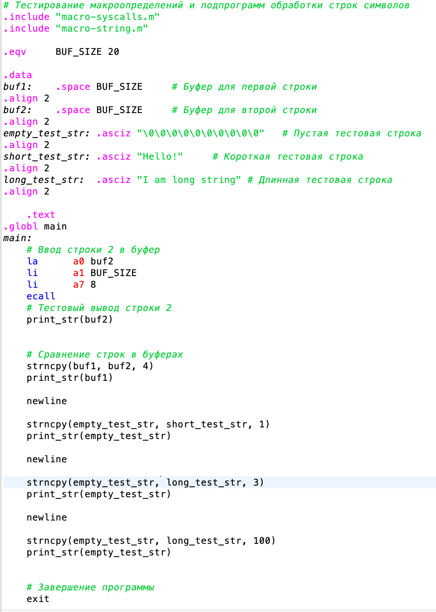
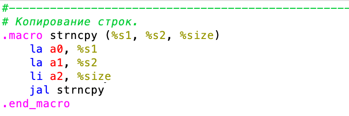

# Отчет по ДЗ #6

## Оценка 8

[Ссылка на программу](program/)

Так выглядит подпрограмма `strncpy`:

Программа по запуску тестов:

## Оценка 9-10

Также был разработан дополнительный макрос в библиотеку по работе со строками:

Итоговую библиотеку с добавленным функционалом можно найти [тут](lib/)