# ИДЗ-1. Вариант 36

🤜[Директория со всеми ассемблерными файлами](program/)🤛

🫱[Точка входа программы](program/main.asm)🫲

🫸[Тестирующая программа](program/tests.asm)🫷

- [ИДЗ-1. Вариант 36](#идз-1-вариант-36)
  - [Задание варианта](#задание-варианта)
  - [Общие требования](#общие-требования)
  - [Логика генерации второго массива](#логика-генерации-второго-массива)
  - [4-5 баллов](#4-5-баллов)
  - [6-7 баллов](#6-7-баллов)
  - [8 баллов](#8-баллов)
    - [Многократное использование подпрограмм](#многократное-использование-подпрограмм)
    - [Дополнительная тестовая программа](#дополнительная-тестовая-программа)
    - [Разные другие изменения](#разные-другие-изменения)
  - [9 баллов](#9-баллов)
    - [Макросы-обертки](#макросы-обертки)
    - [Другие макросы](#другие-макросы)
  - [10 баллов](#10-баллов)
    - [Разбиение на несколько ассемблерных файлов](#разбиение-на-несколько-ассемблерных-файлов)
    - [Библиотека макросов](#библиотека-макросов)


## Задание варианта

> Сформировать массив $B$ из элементов массива $A$, сгруппировав элементы с четными индексами в начале массива, а элементы с нечетными индексами сгруппировать в конце массива $B$.

## Общие требования

Память под массивы выделяться статически. Хранится указатель на начало массива размера $10$. Если фактический размер $n < 10$, то оставшийся участок памяти не используется:

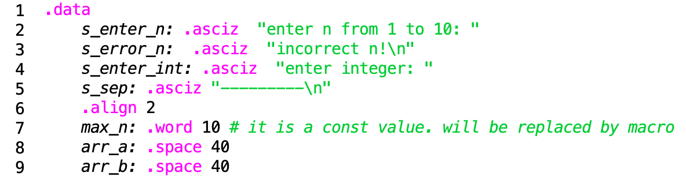

Обрабатываются некорректные значения как для нижней, так и для верхней границ $n$, а именно ввод происходит до тех пор, пока не будет введено корректное значение.

## Логика генерации второго массива

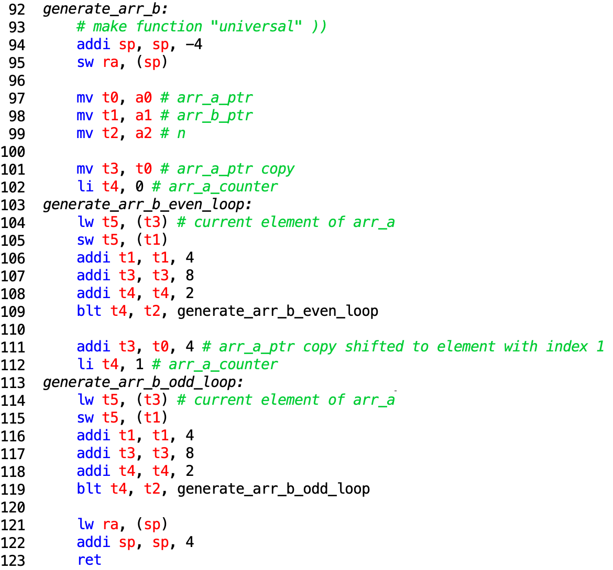

Для генерации массива `arr_b` используются два прохода по исходному массиву с шагом $2$: сначала по четным элементам (ставим их в начало нового массива $B$), затем по нечетным (их оставляем на конец). За это отвечают циклы `generate_arr_b_even_loop` и `generate_arr_b_odd_loop` соответственно.

## 4-5 баллов

Распишем каждое из указанных требований, дополнив их пояснениями и скриншотами.

Ввод данных осуществляется с клавиатуры. Приведенная подпрограмма `get_check_n` позволяет пользователю ввести число элементов в массиве $n$ с клавиатуры. Для этого используется цикл `get_check_n_loop`, который будет запрашивать число до тех пор, пока оно не будет принадлежать отрезку $[1;10]$.

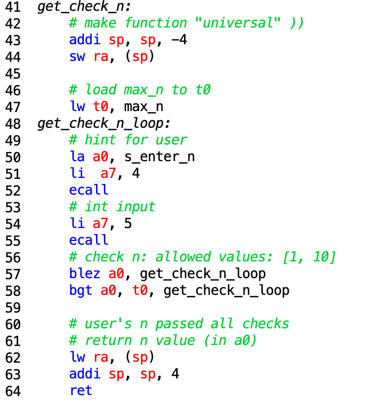

Подпрограмма `get_array_elements` позволяет проинициализировать массив числами, введенными с клавиатуры, с помощью цикла:

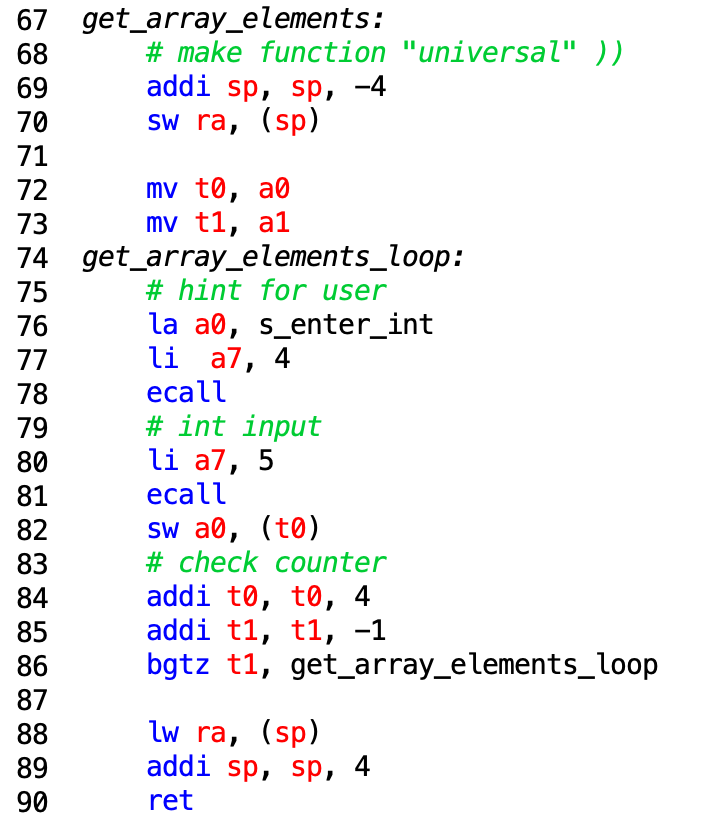

Вывод данных на дисплей также осуществляется с помощью подпрограммы `output_array_loop`:

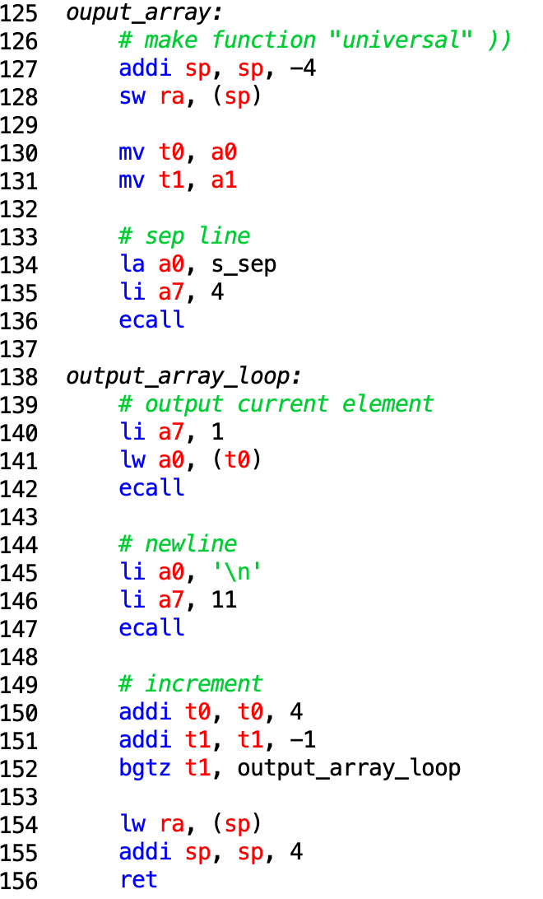

В программе также присутствуют комментарии, поясняющие выполняемые действия, их можно заметить на скриншотах выше.

Предоставим полное тестовое покрытие с помощью скриншотов.

|  $n$  |             `arr_a`              |         expected result          |               test                |
| :---: | :------------------------------: | :------------------------------: | :-------------------------------: |
|   1   |              `[0]`               |              `[0]`               |  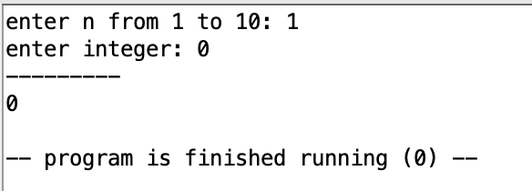  |
|   2   |             `[0, 1]`             |             `[0, 1]`             |  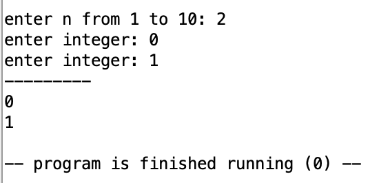  |
|   3   |           `[0, 1, 2]`            |           `[0, 2, 1]`            |  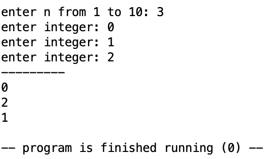  |
|   4   |          `[0, 1, 2, 3]`          |          `[0, 2, 1, 3]`          |  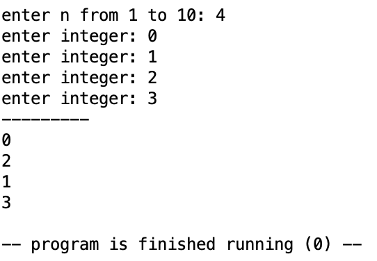  |
|   5   |        `[0, 1, 2, 3, 4]`         |        `[0, 2, 4, 1, 3]`         |  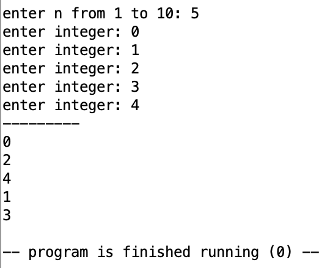  |
|   6   |       `[0, 1, 2, 3, 4, 5]`       |       `[0, 2, 4, 1, 3, 5]`       |  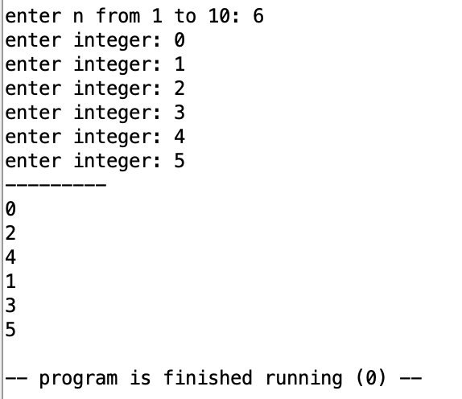  |
|   7   |     `[0, 1, 2, 3, 4, 5, 6]`      |     `[0, 2, 4, 6, 1, 3, 5]`      |  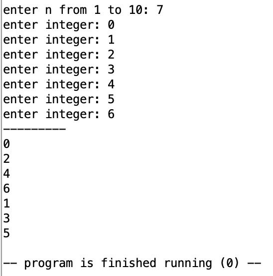  |
|   8   |    `[0, 1, 2, 3, 4, 5, 6, 7]`    |    `[0, 2, 4, 6, 1, 3, 5, 7]`    |    |
|   9   |  `[0, 1, 2, 3, 4, 5, 6, 7, 8]`   |  `[0, 2, 4, 6, 8, 1, 3, 5, 7]`   |  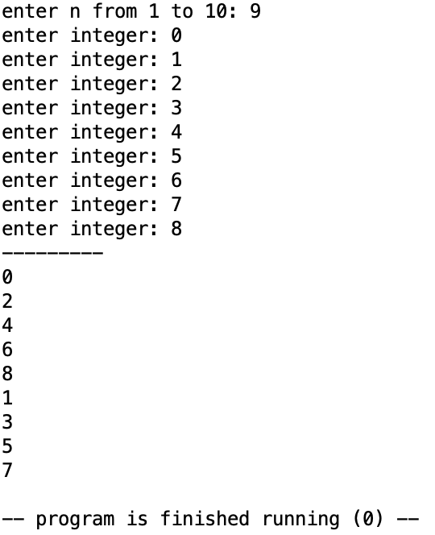  |
|  10   | `[0, 1, 2, 3, 4, 5, 6, 7, 8, 9]` | `[0, 2, 4, 6, 8, 1, 3, 5, 7, 9]` | 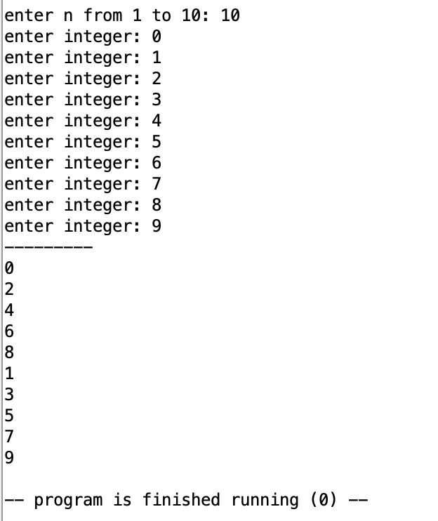 |

Отдельно тест, в котором ввод осуществляется не с первой попытки:

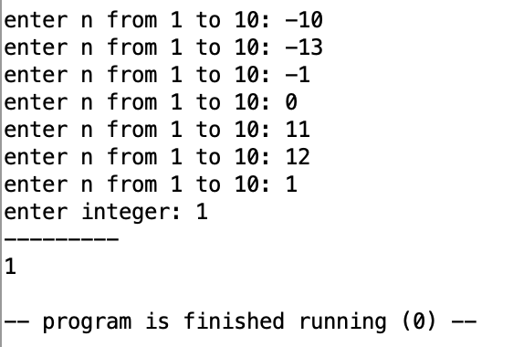

## 6-7 баллов

В этом разделе содержаться критерии, касающиеся подпрограмм и их вызовов, поэтому отдельно разберем каждую из них, показав, что все требования выполняются.

- Подпрограмма `get_check_n`:

Вызов из `main`

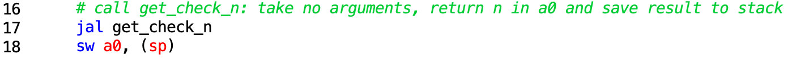

Сама подпрограмма:


Эта подпрограмма не принимает аргументы, возвращает значение $n$ в регистре `a0`.

Адрес возврата сохраняется на стек. Хоть это здесь и излишние, так как подпрограмма является концевой, это требование входит в конвенцию по написанию универсальных подпрограмм.

Локальные переменные сохраняются в регистрах `t*`, стек для их хранения не используется.

- Подпрограмма `get_array_elements`:

Вызов из `main`:

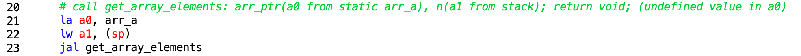

Сама подпрограмма:


Эта подпрограмма принимает два аргумента: адрес начала массива (передается в регистре `a0`), количество элементов в массиве (передается в регистре `a1`). Подпрограмма ничего не возвращает, значение, лежащее в стандартном регистре возврата из подпрограммы, не определено.

Аналогично предыдущей подпрограмме адрес возврата сохраняется на стек.

Локальные переменные сохраняются в регистрах `t*`, стек для их хранения не используется.

- Подпрограмма `generate_arr_b`:

Вызов из `main`:

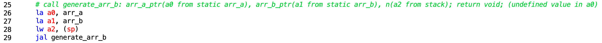

Сама подпрограмма:


Эта подпрограмма принимает три аргумента: адрес начала массива $A$ (передается в регистре `a0`), адрес начала массива $B$ (передается в регистре `a1`), количество элементов в массивах (передается в регистре `a2`). Подпрограмма ничего не возвращает, значение, лежащее в стандартном регистре возврата из подпрограммы, не определено.

Аналогично предыдущим подпрограммам адрес возврата сохраняется на стек.

Локальные переменные сохраняются в регистрах `t*`, стек для их хранения не используется.

- Подпрограмма `output_array`:

Вызов из `main`:

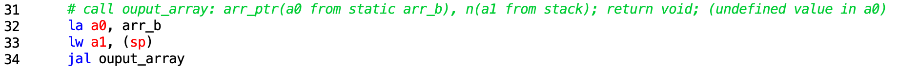

Сама подпрограмма:


Эта подпрограмма принимает два аргумента: адрес начала массива $B$ (передается в регистре `a0`), количество элементов в массиве (передается в регистре `a2`). Подпрограмма ничего не возвращает, значение, лежащее в стандартном регистре возврата из подпрограммы, не определено.

Аналогично предыдущим подпрограммам адрес возврата сохраняется на стек.

Локальные переменные сохраняются в регистрах `t*`, стек для их хранения не используется.

## 8 баллов

Этот раздел состоит из двух основательных требований

### Многократное использование подпрограмм

В разделе [6-7 баллов](#6-7-баллов) перечислялись все функции с перечислением параметров и возвращаемых значений. Заметим, что все эти подпрограммы работают именно с теми массивами, которые передаются в качестве параметров. Это обеспечивает возможное переиспользование данных подпрограмм. Другими словами, поддерживается работа с формальными и
фактическими параметрами.

### Дополнительная тестовая программа

Полный код тестирующей программы расположен 🤜[тут](program/tests.asm)🤛

Тесты расположены в сегменте `.data`, хранится число элементов, входной массив и ожидаемый массив.

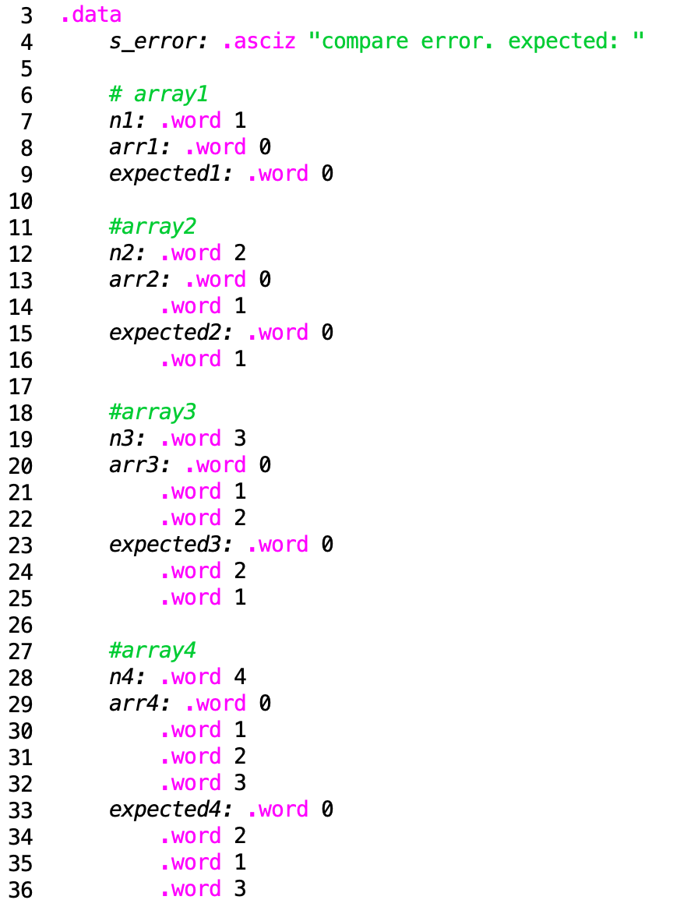

Обработка каждого тестового случая происходит так:

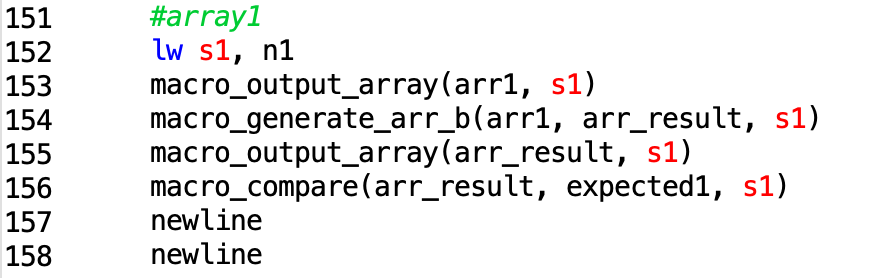

Как мы видим, здесь уже используются макросы. Подробно их использование будет описано в следующем разделе. Здесь же нас больше интересует функция проверки, которая сравнивает фактический результат с ожидаемым массивом.

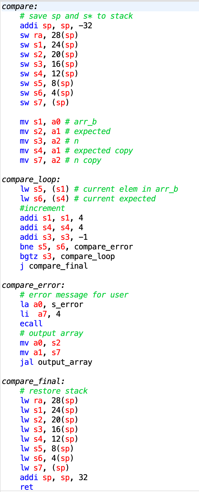

Эта подпрограмма проходится одновременно по двум массивам и сравнивает элементы фактического результата и ожидаемого массива.

Всего было сделано 10 тестов. Покажем вывод:

```
0 
0 


0 1 
0 1 


0 1 2 
0 2 1 


0 1 2 3 
0 2 1 3 


0 1 2 3 4 
0 2 4 1 3 


0 1 2 3 4 5 
0 2 4 1 3 5 


0 1 2 3 4 5 6 
0 2 4 6 1 3 5 


0 1 2 3 4 5 6 7 
0 2 4 6 1 3 5 7 


0 1 2 3 4 5 6 7 8 
0 2 4 6 8 1 3 5 7 


0 1 2 3 4 5 6 7 8 9 
0 2 4 6 8 1 3 5 7 9 


-- program is finished running (0) --
```

И для примера **неправильный** неправильный тест, а именно неправильный ожидаемый результат в этом тесте, чтобы продемонстрировать, что тестирующая программа работает корректно:

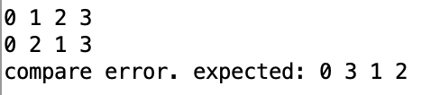

### Разные другие изменения

1. Во всех подпрограммах теперь не используются регистры `t*`. Вместо них используются регистры `s*` с предварительным сохранением на стек значений этих регистров. Это изменение вынуждено, так как с добавлением макросов появляется еще один уровень вложенности, а делать сохранение на стек многих регистров внутри макроса тоже не очень хочется

Для примера:

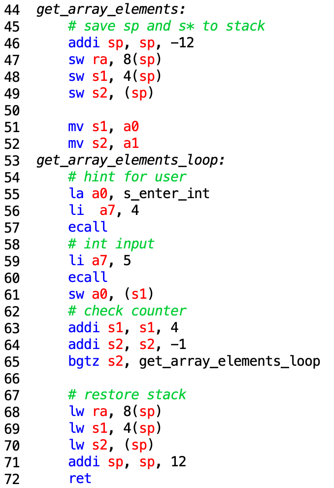

2. Массив теперь выводится в строку через пробел!

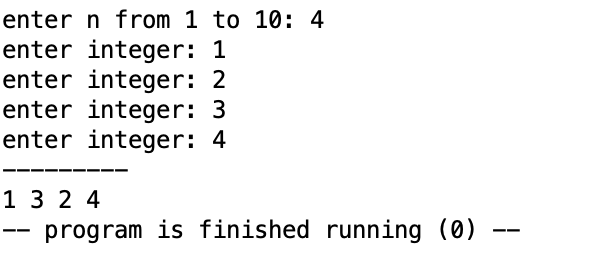

## 9 баллов

Было принято решение в начало названия макроса добавлять префикс `macros_`, чтобы была возможность отличать обертку над подпрограммой и саму подпрограмму, также это решение обеспечивает читаемость кода

### Макросы-обертки

`macro_get_saveaddr_n`:

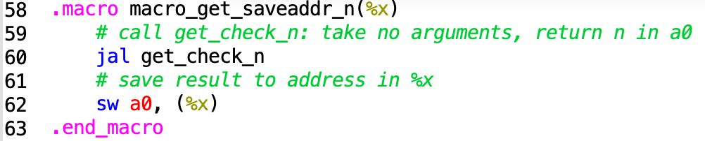

Вызывает функцию `get_check_n` и кладет результат в область памяти по адресу, передаваемому в `%x`

`macro_get_array_elements`:

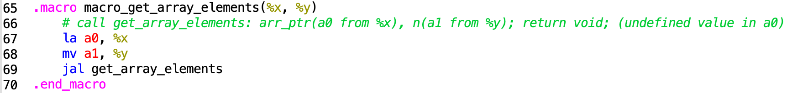

Подготавливает к вызову подпрограммы, кладет значения в нужные регистры, а затем вызывает `get_array_elements`.

`macro_generate_arr_b`:

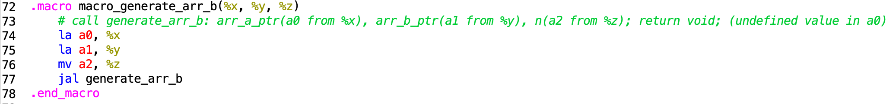

Подготавливает к вызову подпрограммы, кладет значения в нужные регистры, а затем вызывает `generate_arr_b`.

`macro_output_array`:

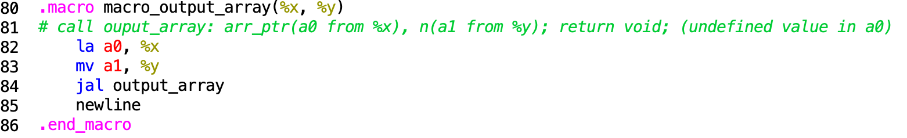

Подготавливает к вызову подпрограммы, кладет значения в нужные регистры, а затем вызывает `output_array`, после исполнения подпрограммы выводит перевод на новую строку.

`macro_compare`:

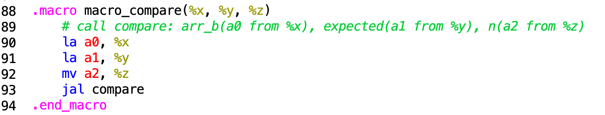

Подготавливает к вызову тестирующей подпрограммы, кладет значения в нужные регистры, а затем вызывает `compare`, после исполнения подпрограммы выводит перевод на новую строку.

### Другие макросы

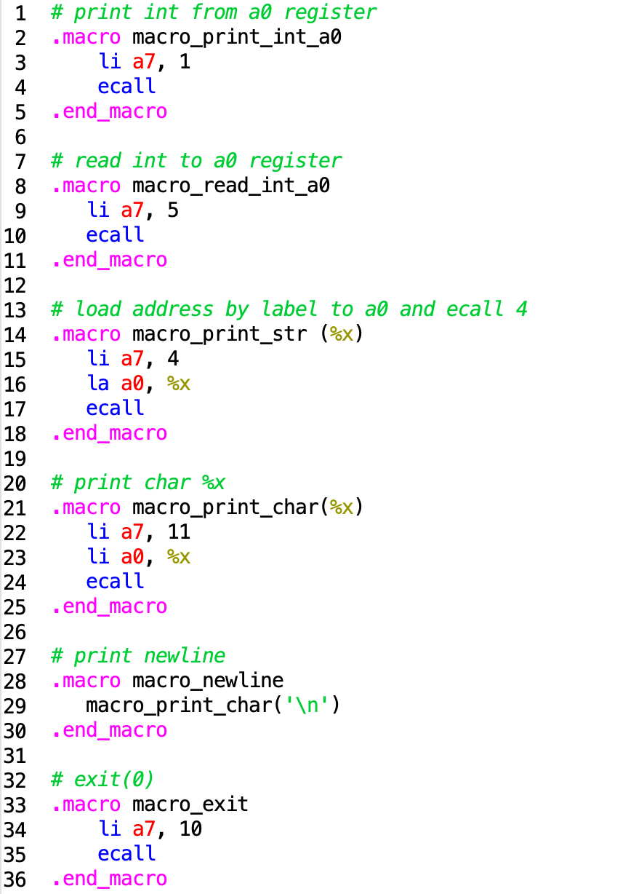

## 10 баллов

### Разбиение на несколько ассемблерных файлов

Программа состоит из следующих файлов

- `generate_arr_b.asm` содержит подпрограмму, генерирующую массив $B$
- `iomod.asm` содержит подпрограммы по вводу выводу информации
- `main.asm` содержит точку запуска программы `main`
- `tests.asm` содержит тесты для программы

### Библиотека макросов

Все макросы, использующиеся в программе выделены в отдельную библиотеку `macrolib.asm`, которая подключается к каждому модулю, где используются макросы с помощью директивы `.include "macrolib.asm"`.