# ИДЗ-2. Вариант 19

*Клычков Максим Дмитриевич БПИ237*

🤜[Директория со всеми ассемблерными файлами](program/)🤛

🫱[Точка входа программы](program/main.asm)🫲

🫸[Тестирующая программа](program/tests.asm)🫷

- [ИДЗ-2. Вариант 19](#идз-2-вариант-19)
  - [Задание варианта](#задание-варианта)
  - [Описание метода решения задачи и источники](#описание-метода-решения-задачи-и-источники)
  - [4-5 баллов](#4-5-баллов)
  - [6-7 баллов](#6-7-баллов)
  - [8 баллов](#8-баллов)
    - [Многократное использование подпрограмм](#многократное-использование-подпрограмм)
    - [Дополнительная тестовая программа](#дополнительная-тестовая-программа)
    - [Проверка корректности вычислений на `Python`](#проверка-корректности-вычислений-на-python)
  - [9 баллов](#9-баллов)
    - [Макросы-обертки](#макросы-обертки)
    - [Другие макросы](#другие-макросы)
  - [10 баллов](#10-баллов)
    - [Разбиение на несколько ассемблерных файлов](#разбиение-на-несколько-ассемблерных-файлов)
    - [Библиотека макросов](#библиотека-макросов)


## Задание варианта

> Разработать программу вычисления корня кубического из заданного числа согласно быстро сходящемуся итерационному алгоритму определения корня n-ной степени с точностью не хуже 0,05%.

## Описание метода решения задачи и источники

Для нахождения кубического корня из числа используется [метод Ньютона](https://ru.wikipedia.org/wiki/%D0%9C%D0%B5%D1%82%D0%BE%D0%B4_%D0%9D%D1%8C%D1%8E%D1%82%D0%BE%D0%BD%D0%B0).

Для изучения метода использовались источники:
- [Википедия](https://ru.wikipedia.org/wiki/%D0%9C%D0%B5%D1%82%D0%BE%D0%B4_%D0%9D%D1%8C%D1%8E%D1%82%D0%BE%D0%BD%D0%B0)
- [StudFiles](https://studfile.net/preview/7071534/page:31/)

## 4-5 баллов

Распишем каждое из указанных требований, дополнив их пояснениями и скриншотами.

Ввод данных осуществляется с клавиатуры. Приведенная подпрограмма `read_x` позволяет пользователю ввести вещественное число, кубический корень которого мы найдем далее.

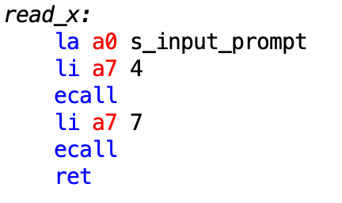

Вывод данных на дисплей также осуществляется с помощью подпрограммы `print_root_x`:

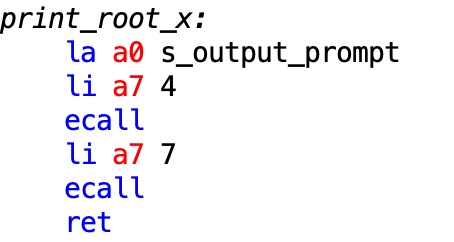

В программе также присутствуют комментарии, поясняющие выполняемые действия.

Предоставим полное тестовое покрытие с помощью скриншотов.

|       $x$        | $\sqrt[3]{x}$ |            screenshot             |
| :--------------: | :-----------: | :-------------------------------: |
|       $0$        |    $0.000$    |  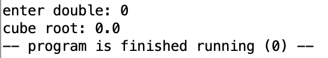  |
|       $1$        |    $1.000$    |  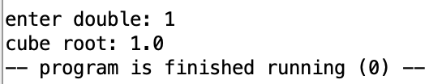  |
|       $-1$       |   $-1.000$    |    |
|      $1000$      |   $10.000$    |  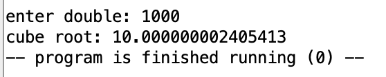  |
|     $-1000$      |   $-10.000$   |  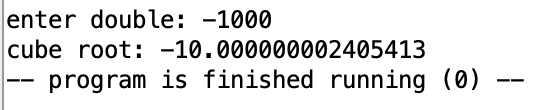  |
|     $0.027$      |    $0.300$    |  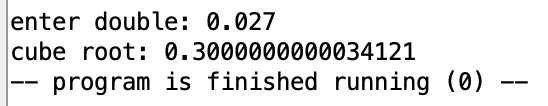  |
|     $-0.027$     |   $-0.300$    |  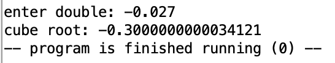  |
|   $1.23456789$   |   $1.0728$    |  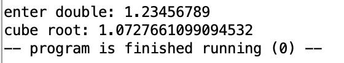  |
|  $-1.23456789$   |   $-1.0728$   |  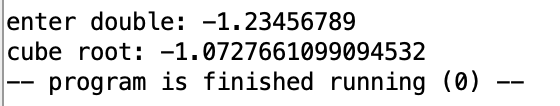  |
| $123124123.123$  |   $497.486$   | 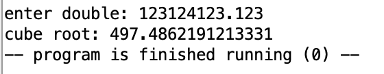 |
| $-123124123.123$ |  $-497.486$   | 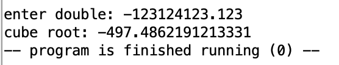 |

## 6-7 баллов

В этом разделе содержаться критерии, касающиеся подпрограмм и их вызовов, поэтому отдельно разберем каждую из них, показав, что все требования выполняются.

- Подпрограмма `cube_root`:

```
cube_root:
	# y = x  # Начальное приближение
  # while True:
  #     y_next = (2 * y + x / (y ** 2)) / 3
  #     # Проверка на достижение заданной точности
  #     if abs(y_next - y) / y_next < tolerance:
  #         return y_next
  #     y = y_next
  
  # variables mapping
	# fs1 <-> x
	# fs2 <-> y
	# fs3 <-> y_next
	# fs4 <-> tolerance
	# s1 <-> sign of x

	# add to stack (also ret address)
	addi sp, sp, -40
	fsd fs1, 32(sp)
	fsd fs2, 24(sp)
	fsd fs3, 16(sp)
	fsd fs4, 8(sp)
	sw s1, 4(sp)
	sw ra, 0(sp)
	
	# check for zero (ans is the same as input - zero)
	li t0, 0
	fcvt.d.w ft0, t0
	feq.d t0, fa0, ft0
	bgtz t0, cube_root_ret
	
	# store sign of x and call abs(x)
	# 0.0 is already in ft0
	flt.d s1, fa0, ft0
	jal abs
	
	# load tolerance
	fld fs4, tolerance, t0
	
	fmv.d fs1, fa0 # copy of x
	fmv.d fs2, fa0 # y
	

cube_root_loop:
	# second term
	fmv.d ft2, fs1
	fdiv.d ft2, ft2, fs2
	fdiv.d ft2, ft2, fs2
	
	# numerator
	li t0, 2
	fcvt.d.w ft0, t0
	fmadd.d fs3, ft0, fs2, ft2
	
	# y_next will be in fs3
	li t0, 3
	fcvt.d.w ft0, t0
	fdiv.d fs3, fs3, ft0
	
	# calling abs function to get abs of (y_next - y) and calculate abs(...)/y_next
	fsub.d fa0, fs3, fs2
	jal abs
	fdiv.d ft0, fa0, fs3
	
	# compare with tolerance
	fgt.d t0, ft0, fs4
	beqz t0, cube_root_prepare_ret
	fmv.d fs2, fs3
	j cube_root_loop

cube_root_prepare_ret:
	# change sign if initial x < 0
	beqz s1 cube_root_ret
	fneg.d fs3, fs3
cube_root_ret:
	fmv.d fa0, fs3
	
	fld fs1, 32(sp)
	fld fs2, 24(sp)
	fld fs3, 16(sp)
	fld fs4, 8(sp)
	lw s1, 4(sp)
	lw ra, 0(sp)
	addi sp, sp, -40
	ret
```

Внутри функции также приведены комментарии, описывающие происходящее.
В комментарии при самом входе в функцию также написан код на `Python`, чтобы понимать происходящее, также маппинг переменных кода `Python` и регистров.

В основном для хранения переменных используются регистры `s*`, при этом в начале и конце функций сохраняются текущие значения на стеке, чтобы при возврате из функции значения из регистров не изменились. Также сохраняется адрес возврата для вызова функций внутри функций.

Вызов из `main`

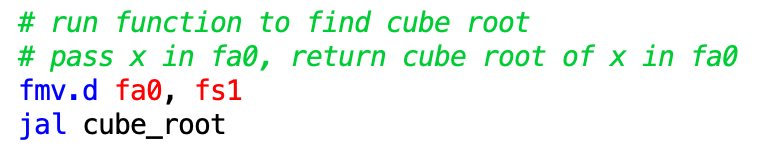

- Подпрограмма `abs`:

Эта подпрограмма возвращает модуль вещественного числа. Логика тут простая: если число меньше нуля, то нужно поменять знак.

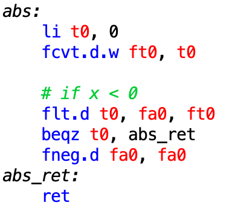

Вызов из `cube_root`:

Всего `abs` вызывается два раза внутри этой функции.

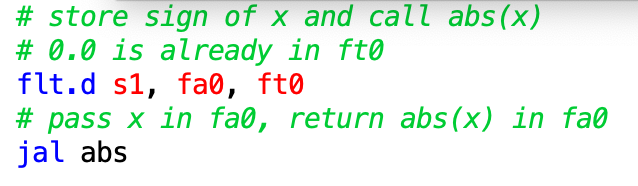

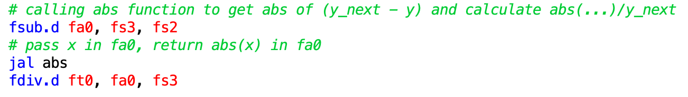

- Подпрограммы ввода и вывода:

Эти подпрограммы выводят строку-подсказку для пользователя и принимают(печатают) вещественное число.

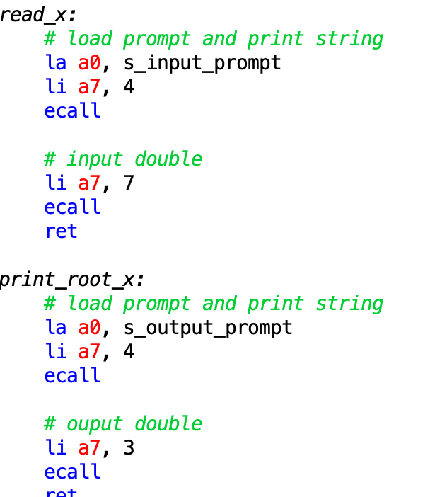

Вызов из `main`:

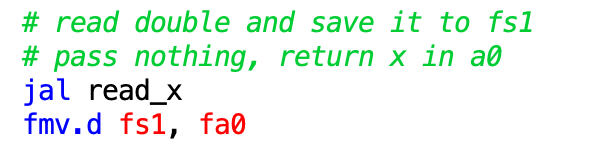

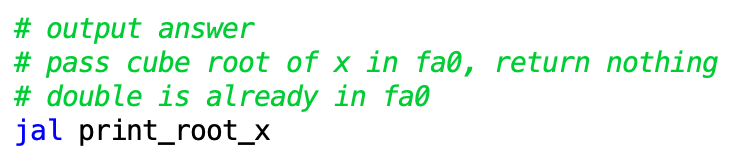

## 8 баллов

Этот раздел состоит из двух основательных требований

### Многократное использование подпрограмм

В разделе [6-7 баллов](#6-7-баллов) перечислялись все функции с перечислением параметров и возвращаемых значений. Заметим, что все эти подпрограммы работают именно с теми данными, которые передаются в качестве параметров. Это обеспечивает возможное переиспользование данных подпрограмм. Другими словами, поддерживается работа с формальными и фактическими параметрами.

### Дополнительная тестовая программа

Полный код тестирующей программы расположен 🤜[тут](program/tests.asm)🤛

Тесты расположены в сегменте `.data`, хранится число, кубический корень из которого хотим брать, и ожидаемый результат.

Для обработки каждого тестового случая используется макрос:

```
# macro to run testcase
.macro macro_run_test(%x, %exp)
	# prompt
	la a0, s_n
	li a7, 4
	ecall
	
	# output initial x
	fld fa0, %x, t0
	li a7, 3
	ecall
	
	# newline
	li a7, 11
	li a0, '\n'
	ecall
	
	# prompt
	la a0, s_expected
	li a7, 4
	ecall
	
	# output expected
	fld fa0, %exp, t0
	li a7, 3
	ecall
	
	# newline
	li a7, 11
	li a0, '\n'
	ecall
	
	# prompt
	la a0, s_result
	li a7, 4
	ecall
	
	# run function
	fld fa0, %x, t0
	jal cube_root
	
	# output result
	li a7, 3
	ecall
	
	# newline
	li a7, 11
	li a0, '\n'
	ecall
	
	# newline
	li a7, 11
	li a0, '\n'
	ecall
.end_macro
```

Теперь вызовы тестовых случаев из программы выглядят так:

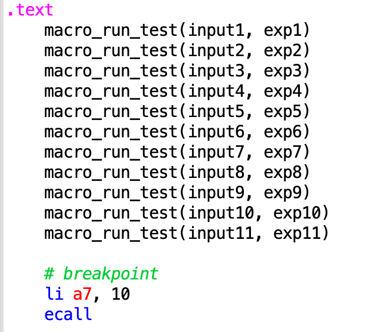

Всего было сделано 11 тестов, точно таких же, как и при ручном тестировании. Покажем вывод:

```
x = 0.0
expected result: 0.0
result: 0.0

x = 1.0
expected result: 1.0
result: 1.0

x = -1.0
expected result: 1.0
result: -1.0

x = 1000.0
expected result: 10.0
result: 10.000000002405413

x = -1000.0
expected result: -10.0
result: -10.000000002405413

x = 0.027
expected result: 0.3
result: 0.3000000000034121

x = -0.027
expected result: -0.3
result: -0.3000000000034121

x = 1.23456789
expected result: 1.0728
result: 1.0727661099094532

x = -1.23456789
expected result: -1.0728
result: -1.0727661099094532

x = 1.23124123123E8
expected result: 497.486
result: 497.4862191213331

x = -1.23124123123E8
expected result: -497.486
result: -497.4862191213331
```

### Проверка корректности вычислений на `Python`

Напишем код, который будет производить указанные вычисления на `Python`.

```python
def run_test(x, exp):
    print(f"x: {x}")
    print(f"exp: {exp}")
    print(f"result: {x**(1./3.) if 0<=x else -(-x)**(1./3.)}")
    print()

testcases = [
    (0., 0.),
    (1., 1.),
    (-1., -1.),
    (1000., 10.),
    (-1000., -10.),
    (0.027, 0.3),
    (-0.027, -0.3),
    (1.23456789, 1.0728),
    (-1.23456789, -1.0728),
    (123124123.123, 497.486),
    (-123124123.123, -497.486),
]

for testcase in testcases:
    run_test(*testcase)
```

Вывод программы:

```
x = 0.0
exp: 0.0
result: 0.0

x = 1.0
exp: 1.0
result: 1.0

x = -1.0
exp: -1.0
result: -1.0

x = 1000.0
exp: 10.0
result: 9.999999999999998

x = -1000.0
exp: -10.0
result: -9.999999999999998

x = 0.027
exp: 0.3
result: 0.30000000000000004

x = -0.027
exp: -0.3
result: -0.30000000000000004

x = 1.23456789
exp: 1.0728
result: 1.0727659796410873

x = -1.23456789
exp: -1.0728
result: -1.0727659796410873

x = 123124123.123
exp: 497.486
result: 497.48621376812054

x = -123124123.123
exp: -497.486
result: -497.48621376812054
```

## 9 баллов

Было принято решение в начало названия макроса добавлять префикс `macros_`, чтобы была возможность отличать обертку над подпрограммой и саму подпрограмму, также это решение обеспечивает читаемость кода.

### Макросы-обертки

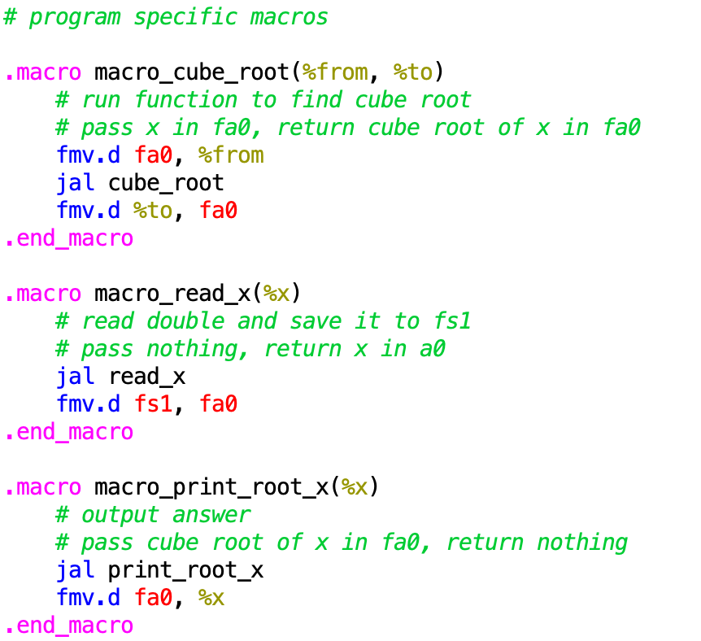

На каждую основную функцию был создан макрос-обертка, чтобы вызов функций был более читаемым. Эти макросы просто кладут переменные в нужный регистр и запускают функцию, затем, возможно перекладывают результат в другой регистр.

Также иной вид принял макрос по запуску тестов:


### Другие макросы

Также было разработано множество макросов для ввода-вывода и выхода из программы:

```
# common macros

# read double to fa0 register
.macro macro_read_double_fa0
   li a7, 7
   ecall
.end_macro

# read double to any register
.macro read_double(%x)
   macro_read_double_fa0
   mv %x, fa0
.end_macro

# print double from fa0 register
.macro macro_print_double_fa0
	li a7, 3
	ecall
.end_macro

# print double from any register
.macro macro_print_double(%x)
	fmv.d fa0, %x
	macro_print_double_fa0
.end_macro

.macro macro_print_double_addr(%x)
	fld fa0, %x, t0
	macro_print_double_fa0
.end_macro

# load address by label to a0 and ecall 4 
.macro macro_print_str (%x)
   li a7, 4
   la a0, %x
   ecall
.end_macro

# print char %x
.macro macro_print_char(%x)
   li a7, 11
   li a0, %x
   ecall
.end_macro

# print newline
.macro macro_newline
   macro_print_char('\n')
.end_macro

# exit(0)
.macro macro_exit
    li a7, 10
    ecall
.end_macro
```

## 10 баллов

### Разбиение на несколько ассемблерных файлов

Программа состоит из следующих файлов

- `cube_root.asm` содержит подпрограмму, генерирующую массив $B$
- `iomod.asm` содержит подпрограммы по вводу выводу информации
- `main.asm` содержит точку запуска программы `main`
- `tests.asm` содержит тесты для программы

### Библиотека макросов

Все макросы, использующиеся в программе выделены в отдельную библиотеку `macrolib.asm`, которая подключается к каждому модулю, где используются макросы с помощью директивы `.include "macrolib.asm"`.