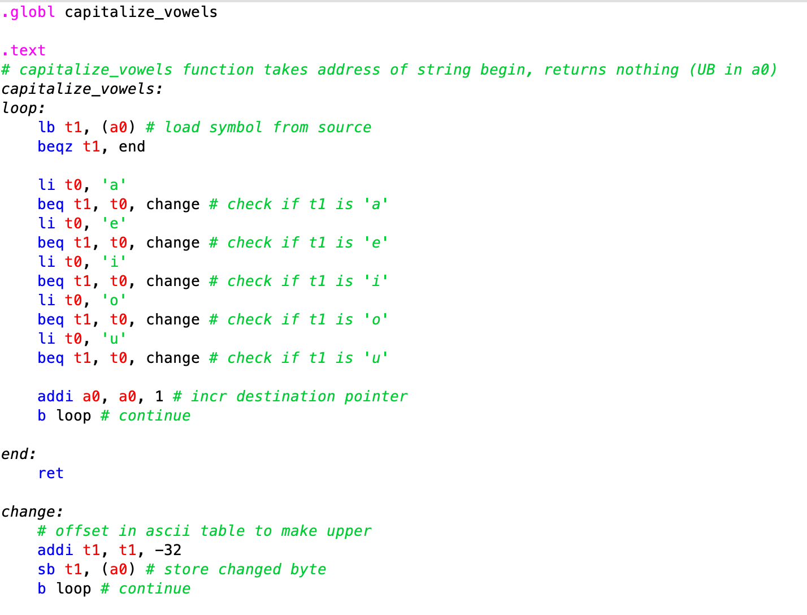
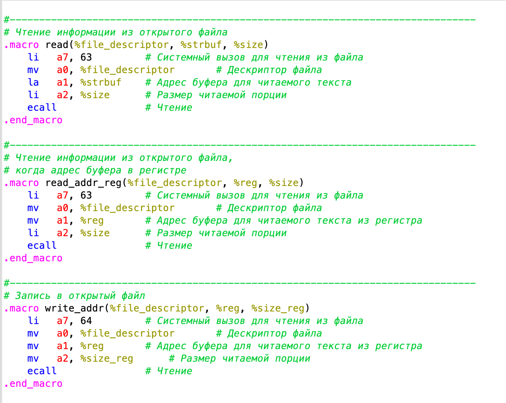
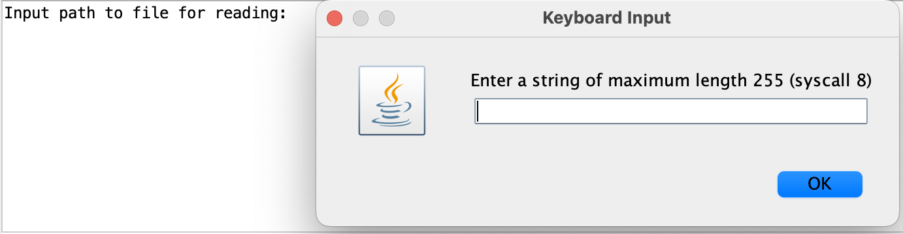
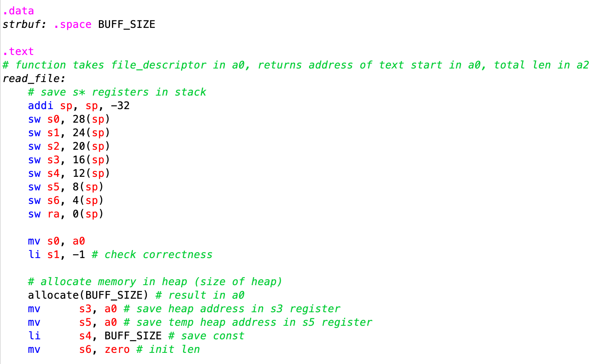
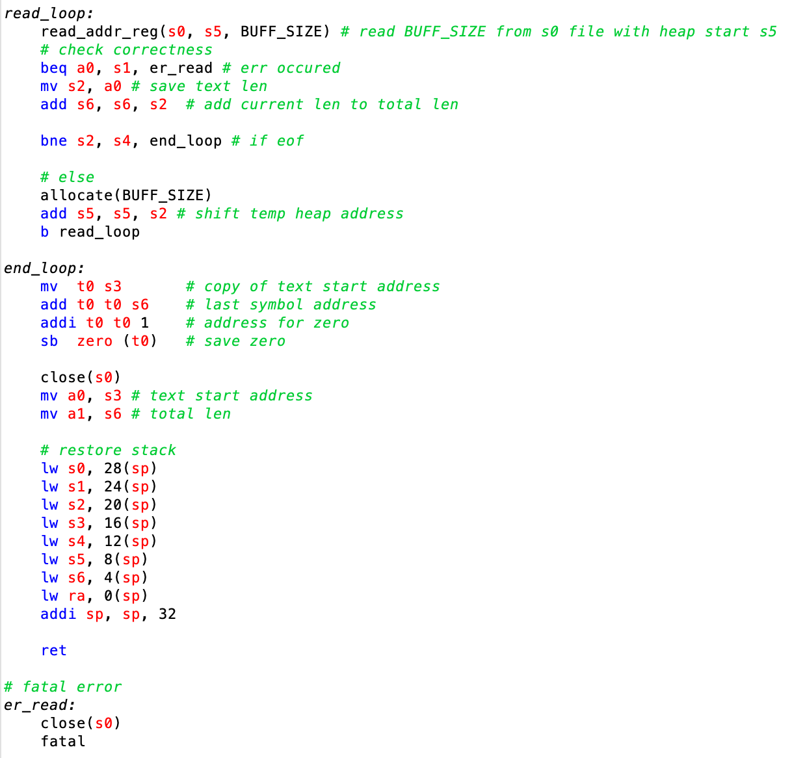
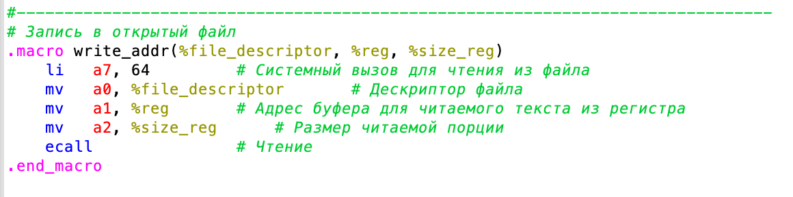
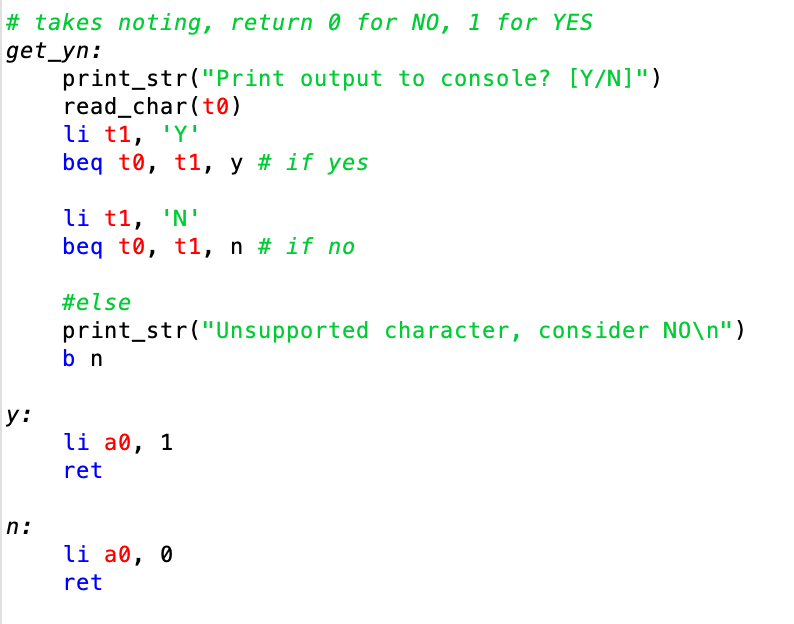
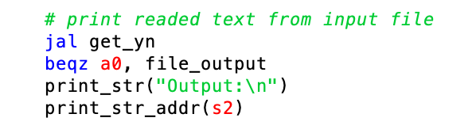
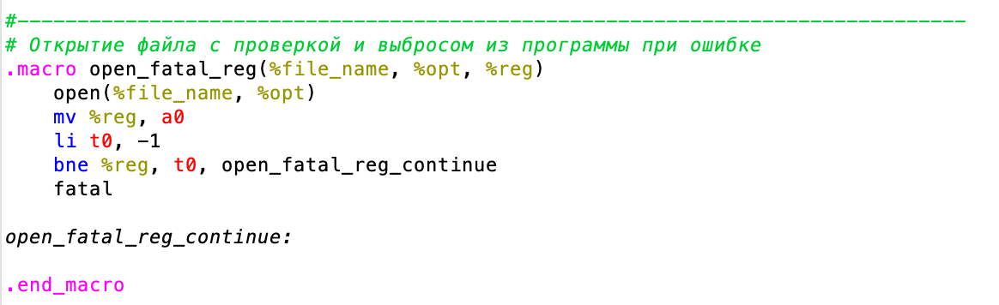
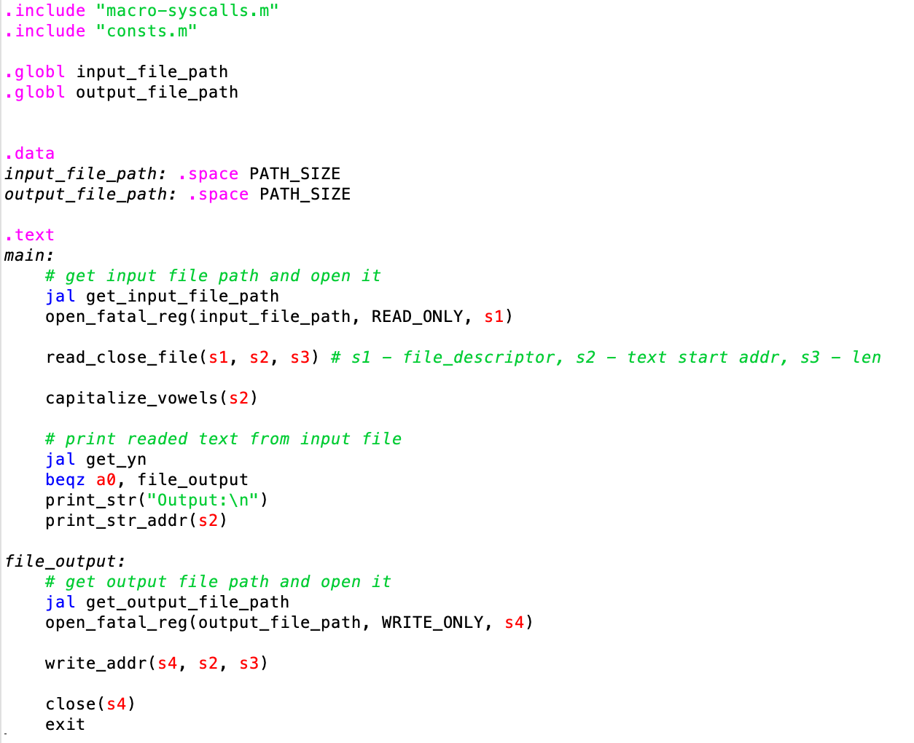

# ИДЗ-3. Вариант 5

*Клычков Максим Дмитриевич БПИ237*

🤜[Директория со всеми ассемблерными файлами](program/)🤛

🫱[Точка входа программы](program/main.asm)🫲

🫸[Тестирующая программа](program/tests.asm)🫷

👉[Тестовые данные](test_data/)👈

- [ИДЗ-3. Вариант 5](#идз-3-вариант-5)
  - [Задание варианта](#задание-варианта)
  - [Описание метода решения задачи и источники](#описание-метода-решения-задачи-и-источники)
  - [4-5 баллов](#4-5-баллов)
  - [6-7 баллов](#6-7-баллов)
  - [8 баллов](#8-баллов)
  - [Возможность дублирования вывода в консоль](#возможность-дублирования-вывода-в-консоль)
  - [Автоматическое тестирования](#автоматическое-тестирования)
  - [9 баллов](#9-баллов)
    - [Макросы-обертки](#макросы-обертки)
    - [Другие макросы](#другие-макросы)
  - [10 баллов](#10-баллов)
    - [Разбиение на несколько ассемблерных файлов](#разбиение-на-несколько-ассемблерных-файлов)
    - [Библиотека макросов](#библиотека-макросов)
  - [Графические диалоговые окна](#графические-диалоговые-окна)


## Задание варианта

> Разработать программу, заменяющую все строчные гласные буквы в заданной ASCII–строке заглавными.

## Описание метода решения задачи и источники

На вход подпрограмме, выполняющей преобразование строки подается лишь адрес начала строки, на выход ничего не отдается. Запускается цикл, оканчивающийся на символе "ноль". В теле цикла проверяется, является ли символ одним из перечисленных: `[a, e, i, o, u]`. При выполнении условия происходит замена этого символа на тот же, но со сдвигом `-32` по таблице ASCII.



## 4-5 баллов

Распишем каждое из указанных требований, дополнив их пояснениями и скриншотами.

> Приведено решение программы на ассемблере. Программа из файла читает данные. Результаты записываются в другой файл.

Для этих действий используются макросы с семинара.



Далее по тексту требуется реализовать ввод с помощью встроенного диалогового окна `RARS`, поэтому сразу было реализовано это решение.



В программе также присутствуют комментарии, поясняющие выполняемые действия (см. скриншоты).

Присутствуют файлы тестирования. Они расположены в [директории](test_data/)

Далее по тексту требуется реализовать буферизированный ввод частями по `512 bytes`. Сразу же реализуем это требование, так как оно является наиболее сложным по сравнению с чтением ограниченного числа байт.

Разберем функцию буферизированного ввода по частям.



В функции будут использоваться регистры `s*`, поэтому перед началом работы прошлые значения необходимо сохранить на стеке. Также впервые аллоцируется память в куче для первого прочтения `512 bytes`.



Далее запускается цикл, который записывает в кучу прочтенные `512 bytes`, проверяет не закончился ли еще файл. Если данные еще остались, то вновь аллоцирует память. По окончании цикла в строку дописывается символ окончания ASCII строки --- `\0`, восстанавливается сте. Также присутствует обработка ошибки при чтении из файла.

## 6-7 баллов

Внутри всех функций используются регистровые переменные, также в функции `read_file` используется сохранение на стек.

Описание работы буфера уже было описано ранее в разделе [4-5 баллов](#4-5-баллов).

Ввод исходных данных, их обработка производится через подпрограммы (см. выше). Для вывода результатов используется макрос, а не подпрограмма, так как вывод в файл --- это буквально один системный вызов.



Подпрограммы получают необходимые им данные через параметры в соответствии с принятым соглашением о передаче параметров. Также возвращаемые из подпрограмм значения возвращаются через параметры в соответствии с общепринятыми соглашениями (см. выше).

## 8 баллов

## Возможность дублирования вывода в консоль

Была добавлена возможность дополнительного вывода результатов на консоль. Выводить или нет решает пользователь отвечая «Y» или «N» на соответствующий вопрос компьютерной программы. Вывод программы при этом должен полностью соответствовать выводу результатов в файл.

Для получения `[Y\N]` от пользователя была написана подпрограмма:



Далее в `main` программы в зависимости от ответа пользователя выводится преобразованная строка:



## Автоматическое тестирования

Также была разработана отдельная программа тестирования, которая осуществляет многократный вызов процедур, обеспечивающих ввод файлов, их обработку и вывод для различных исходных данных, расположенных в каталоге с исходными тестовыми данными.

```
.include "macro-syscalls.m"
.include "consts.m" 

.data
test1_input: .asciz "../test_data/test-all.txt"
test1_output: .asciz "../test_data/output/test-all.o"

test2_input: .asciz "../test_data/test-digits"
test2_output: .asciz "../test_data/output/test-digits.o"

test3_input: .asciz "../test_data/test-multi_line.extension"
test3_output: .asciz "../test_data/output/test-multi_line.o"

test4_input: .asciz "../test_data/test-one_line"
test4_output: .asciz "../test_data/output/test-one_line.o"

test5_input: .asciz "../test_data/test-strange"
test5_output: .asciz "../test_data/output/test-strange.o"

.text
	# test1
	open_fatal_reg(test1_input, READ_ONLY, s1)
	read_close_file(s1, s2, s3)
	
	capitalize_vowels(s2)
	
	open_fatal_reg(test1_output, WRITE_ONLY, s4)
	write_addr(s4, s2, s3)
	close(s4)
	
	# test2
	open_fatal_reg(test2_input, READ_ONLY, s1)
	read_close_file(s1, s2, s3)
	
	capitalize_vowels(s2)
	
	open_fatal_reg(test2_output, WRITE_ONLY, s4)
	write_addr(s4, s2, s3)
	close(s4)
	
	# test3
	open_fatal_reg(test3_input, READ_ONLY, s1)
	read_close_file(s1, s2, s3)
	
	capitalize_vowels(s2)
	
	open_fatal_reg(test3_output, WRITE_ONLY, s4)
	write_addr(s4, s2, s3)
	close(s4)
	
	# test4
	open_fatal_reg(test4_input, READ_ONLY, s1)
	read_close_file(s1, s2, s3)
	
	capitalize_vowels(s2)
	
	open_fatal_reg(test4_output, WRITE_ONLY, s4)
	write_addr(s4, s2, s3)
	close(s4)
	
	# test5
	open_fatal_reg(test5_input, READ_ONLY, s1)
	read_close_file(s1, s2, s3)
	
	capitalize_vowels(s2)
	
	open_fatal_reg(test5_output, WRITE_ONLY, s4)
	write_addr(s4, s2, s3)
	close(s4)
	
	print_str("Testing finished.\n")
	print_str("Output files saved to ../test_data/output/")
	
	exit
```

Эта программа наполнена различными макросами, о которых еще не писалось ранее. Разберемся с ними в следующих пунктах.

## 9 баллов

### Макросы-обертки




На каждую основную функцию был создан макрос-обертка, чтобы вызов функций был более читаемым. Эти макросы просто кладут переменные в нужный регистр и запускают функцию, затем, возможно перекладывают результат в другой регистр.

С введенными макросами `main` программы выглядит следующим образом:



### Другие макросы

Также было разработано множество макросов для ввода-вывода, выхода из программы и других целей. Некоторые из них были позаимствованы с семинаров. С ними можно ознакомиться в отдельной [библиотеке макросов](program/macro-syscalls.m).

## 10 баллов

### Разбиение на несколько ассемблерных файлов

Программа состоит из следующих файлов

- [`algorithm.asm`](program/algorithm.asm) содержит подпрограмму с требуемым алгоритмом обработки строк
- [`consts.m`](program/consts.m) содержит некоторые константы, обозначенные `.eqv`
- [`file_utils.asm`](program/file_utils.asm) содержит подпрограмму для буферизированного чтения файла
- [`io.asm`](program/io.asm) содержит подпрограммы по взаимодействию с пользователем через консоль или диалоговые окна
- [`macro-syscalls.m`](program/macro-syscalls.m) содержит макросы
- [`main.asm`](program/main.asm) является точкой входа в программу

Отдельную программу представляет файл [`test.asm`](program/test.asm)

### Библиотека макросов

Все макросы, использующиеся в программе выделены в отдельную библиотеку `macro-syscalls.m`, которая подключается к каждому модулю, где используются макросы с помощью директивы `.include "macro-syscalls.m"`.

## Графические диалоговые окна

Ранее в пункте [4-5 баллов](#4-5-баллов) уже было показано, как выглядят диалоговые окна в программе.